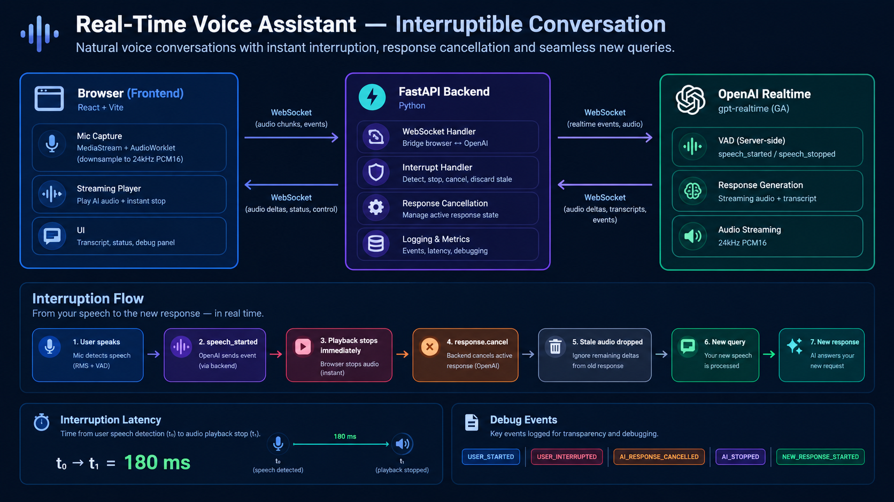

# A Voice You Can Interrupt

A small voice booking assistant, **Sam**, with true **barge-in**. While Sam is speaking, the moment you start talking he stops — mid-word if needed — cancels the in-flight reply, and handles your new request. It is not “wait until the AI finishes, then send the next message.”

| Layer | Stack |
|---|---|
| Frontend | React + Vite, Web Audio API / AudioWorklet, WebSocket |
| Backend | FastAPI (Python) — stateful relay so the OpenAI key never reaches the browser |
| Voice / LLM | OpenAI Realtime API (`gpt-realtime`) — speech-to-speech, streaming audio, server-side VAD |

---

## Architecture



The browser never talks to OpenAI directly. The Realtime API needs `OPENAI_API_KEY` on the handshake; putting that in the frontend would leak it. FastAPI holds the key, opens the upstream socket, and relays a smaller event protocol to the client.

```
voice-interrupt-assistant/
├── backend/
│   ├── app/
│   │   ├── main.py        # FastAPI app + /ws/conversation
│   │   ├── session.py     # Relay, barge-in, response.cancel
│   │   └── config.py      # Env-driven settings (no hardcoded secrets)
│   ├── requirements.txt
│   └── .env.example
├── frontend/
│   ├── public/audio-processor.worklet.js
│   ├── src/
│   │   ├── audio/audioUtils.js
│   │   ├── hooks/useConversation.js
│   │   └── components/
│   ├── package.json
│   └── .env.example
├── workflow.png
└── .gitignore             # ignores .env, venv/, node_modules/
```

---

## Setup

**Needs:** Python 3.10+, Node 18+, an [OpenAI API key](https://platform.openai.com/api-keys) with Realtime access.

Copy `.env.example` → `.env` and put your real key in **`backend/.env`** only. That file is gitignored and is not uploaded to GitHub.

### Backend

```powershell
cd backend
python -m venv venv
.\venv\Scripts\Activate.ps1          # macOS/Linux: source venv/bin/activate
pip install -r requirements.txt

copy .env.example .env               # macOS/Linux: cp .env.example .env
# edit .env → OPENAI_API_KEY=sk-...

python -m app.main
```

Server: `http://localhost:8000` · health: `GET /health`.

### Frontend

```powershell
cd frontend
npm install

copy .env.example .env               # macOS/Linux: cp .env.example .env
# VITE_WS_URL=ws://localhost:8000/ws/conversation  (already the default)

npm run dev
```

Open `http://localhost:5173`, click **Start Conversation**, allow the mic, and talk.

Mic access needs a secure context (`localhost` is fine; production needs HTTPS / WSS).

---

## How interruption works

### Turn detection (server VAD)

The backend configures OpenAI with server-side VAD. Defaults from `backend/.env.example`:

```json
"turn_detection": {
  "type": "server_vad",
  "threshold": 0.5,
  "prefix_padding_ms": 300,
  "silence_duration_ms": 400,
  "create_response": true,
  "interrupt_response": true
}
```

- **`silence_duration_ms` (400ms)** is the “um…” vs “that’s all” knob. OpenAI only fires `speech_stopped` after this much quiet. A filler pause is usually shorter, so the turn is not cut off. A real end-of-sentence pause is longer, and Sam replies.
- Starting an interrupt does **not** wait for silence. Any speech onset (`speech_started`) while Sam is talking is a barge-in.

### Path (`backend/app/session.py`)

1. The browser streams 24 kHz PCM16 mic frames the whole time, even while Sam is talking.
2. The backend forwards them with `input_audio_buffer.append`.
3. If OpenAI sends `speech_started` while `ai_speaking` is true:
   1. The current `response_id` is added to `cancelled_response_ids` so late `response.audio.delta` events are dropped.
   2. `{"type": "interrupt", ...}` is sent to the browser **immediately** (no round-trip to OpenAI first).
   3. `response.cancel` is sent upstream so OpenAI stops generating the abandoned reply.
4. The browser’s `StreamingPlayer` calls `.stop()` on every scheduled `AudioBufferSourceNode` in the same tick.
5. The mic stream never paused, so the new utterance is already in a fresh buffer. When the user stops, `speech_stopped` fires and a new response starts (`create_response: true`).

The frontend also uses a **local RMS VAD**. OpenAI can finish *generating* audio before it has finished *playing*, so queued buffers would keep talking if we only waited for server VAD. Local VAD stops playback the instant your mic energy rises; server VAD remains the authority for cancelling the OpenAI response.

### Latency

Measured on the client:

- **t0** — local RMS VAD rising edge (no network)
- **t1** — `interrupt` received and playback stopped
- **Latency = t1 − t0** — last / average / best / worst in the Latency panel

### Debug events

`USER_STARTED`, `AI_STARTED`, `USER_INTERRUPTED`, `AI_RESPONSE_CANCELLED`, `AI_STOPPED`, `NEW_QUERY_STARTED`, `NEW_RESPONSE_STARTED`, plus `USER_STOPPED`, `CLIENT_PLAYBACK_STOPPED`, `WS_DISCONNECTED`, `ERROR`.

---

## Demo

1. **Normal turn.** *“Book me a dentist appointment tomorrow.”* Badge: Listening → Thinking → Speaking → Listening.
2. **Hard interrupt.** Ask something long, then cut in: *“Wait! Make that Friday instead.”* Debug log should show `USER_STARTED → USER_INTERRUPTED → AI_RESPONSE_CANCELLED → AI_STOPPED`.
3. **New request in the same breath.** *“…actually, cancel that, book a haircut instead.”* Sam should answer the haircut, not the abandoned dentist reply.
4. **Trailing off.** *“I’d like the, um… the appointment for… tomorrow morning.”* Sam should wait through “um”, then reply.
5. **Latency panel.** After a few interrupts, read last / average / best / worst (ms).

---

## Failure handling

| Case | What happens |
|---|---|
| WebSocket drops | Client shows “Reconnecting…” and retries with backoff (500ms → 8s). New backend + OpenAI session on reconnect. |
| Bad key / OpenAI unreachable | `RealtimeSession.run()` sends an `error` message; UI shows a banner. |
| Mic denied | `getUserMedia` fails; no WebSocket is opened. |
| Audio after cancel | Dropped via `cancelled_response_ids`; client also hard-stops queued nodes. |
| Double barge-in | Each `speech_started` re-checks `ai_speaking` and cancels again. |
| Tab closed | Cleanup closes the socket, mic tracks, and AudioContext. |

---

## Tuning

| Variable | Default | Role |
|---|---|---|
| `OPENAI_REALTIME_MODEL` | `gpt-realtime` | Change model without code edits |
| `OPENAI_VOICE` | `alloy` | Spoken voice |
| `VAD_SILENCE_DURATION_MS` | `400` | Patience with pauses — raise for slower talkers |
| `VAD_THRESHOLD` | `0.5` | Server VAD sensitivity |
| `VAD_PREFIX_PADDING_MS` | `300` | Audio kept before detected speech start |

Booking is simulated: Sam confirms details out loud. There is no real calendar.
